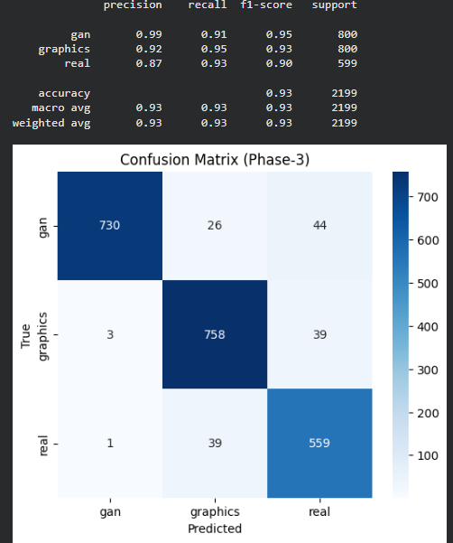
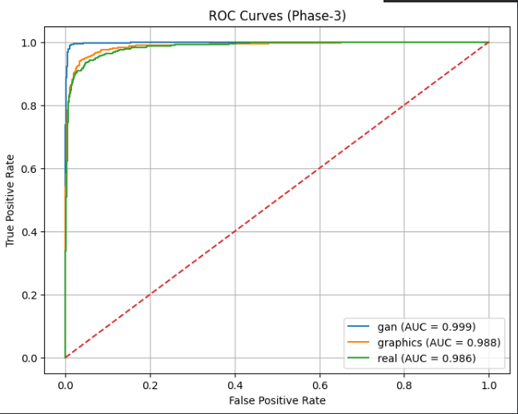
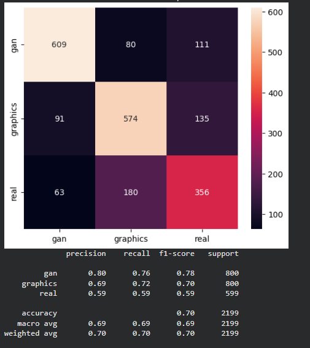
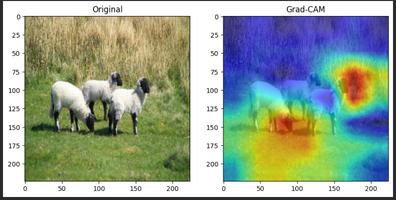

# 🧠 GAN vs CG vs Real Image Classification

## 📌 Overview

This project focuses on **multi-class image classification** to detect whether an image is:

* 🟢 Real (Photographic)
* 🔵 Computer-Generated (CG)
* 🔴 GAN-Generated

With the rise of AI-generated content and deepfakes, distinguishing synthetic images from real ones is important for **digital forensics, cybersecurity, and media verification**.

---

## 🎯 Problem Statement

Most existing approaches solve **binary classification (Real vs Fake)**.
This project tackles a more challenging problem:

➡️ **3-class classification: GAN vs CG vs Real**
➡️ Handles **high similarity between CG and Real images**
➡️ Detects **subtle texture and noise differences**

---

## 🧠 Models Used

### 🔹 EfficientNetB0 (Baseline)

* Transfer learning using ImageNet
* Used as initial model
* Provides strong baseline performance

### 🔹 ResNet50 (Improved Model)

* Deep residual architecture
* Better feature extraction
* Improved generalization
* Significant accuracy improvement

---

## ⚙️ Techniques Used

* Transfer Learning
* Data Augmentation
* Class Imbalance Handling (Focal Loss)
* Fine-Tuning (layer unfreezing)
* Multi-phase training
* Grad-CAM (Explainable AI)

---

## 📊 Results & Performance

### 🔹 Accuracy Comparison

| Model          | Accuracy   |
| -------------- | ---------- |
| EfficientNetB0 | **69.99%** |
| ResNet50       | **93%**    |

📌 Test Accuracy: **93% on 2199 images**

---

### 🔹 Confusion Matrix (ResNet50)



---

### 🔹 ROC Curve (ResNet50)



---

### 🔹 EfficientNet Baseline



---

### 🔹 Grad-CAM Visualization



---

## 🔍 Key Insights

* Accuracy improved from **~70% → 93%**
* GAN images are easiest to classify
* CG images are hardest due to similarity with real images
* Deep models like ResNet50 improve performance significantly
* Grad-CAM shows model focuses on important texture regions

---

## 📂 Dataset

* Total Images: ~12,000
* Classes: GAN, CG, Real
* Split:

  * Train: 60%
  * Validation: 20%
  * Test: 20%

⚠️ Dataset not included due to size constraints.

---

## ⚙️ Tech Stack

* Python
* TensorFlow / Keras
* OpenCV
* NumPy, Pandas
* Matplotlib

---

## 📁 Project Structure

```
project/
│
├── images/
│   ├── resnet_confusion.png
│   ├── resnet_roc.png
│   ├── efficientnet_confusion.png
│   ├── gradcam_output.png
│
├── gancgreal.ipynb
├── gancgrealpart2.ipynb
├── gancgrealpart3.ipynb
├── RESNET50 MODEL.ipynb
├── gradcamadded.ipynb
├── README.md
```

---

## 🚀 Features

* Multi-class classification (GAN vs CG vs Real)
* Model comparison (EfficientNet vs ResNet50)
* Significant accuracy improvement
* Explainable AI using Grad-CAM
* Real-world forensic application

---

## 📚 References

1. M.P. Gangan et al., *Multi-Colorspace Fused EfficientNet*, 2021
2. K.B. Meena & V. Tyagi, *Two-stream CNN Technique*, 2020

---

## 👩‍💻 Author

Ojasvi Mishra
B.Tech CSE
Jaypee University of Engineering & Technology

---

## ⭐ Note

This project demonstrates deep learning techniques for **image authenticity detection and forensic analysis**.

